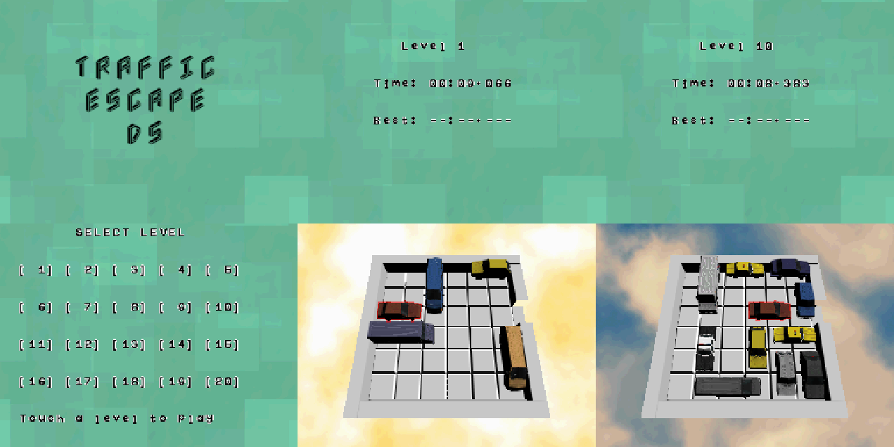

<p align="center">
  
</p>

<p align="center">
  <b>A Rush Hour-style traffic puzzle game for Nintendo DS / DSi</b>
</p>

<p align="center">
  <a href="LICENSE"></a>
  
  
</p>

---

Slide vehicles on a 6x6 grid to clear a path and let the red car escape! Traffic Escape DS brings the classic sliding-block puzzle to the Nintendo DS with real-time 3D rendered vehicles, touchscreen controls, and 20 hand-crafted levels of increasing difficulty.



## Features

- **3D rendered vehicles** using the NDS hardware GPU with textured models and shadows
- **Touch controls** - drag vehicles with the stylus to slide them on the grid
- **20 levels** of increasing difficulty
- **Level selection** screen with touch-based UI
- **Timer & best times** - track your solve time and try to beat your record
- **Background music** with streamed WAV audio
- **Sound effects** for car selection, movement, UI interactions, and level completion
- **Save system** - best times are saved to FAT storage
- **Runs on real hardware** - Nintendo DS and DSi (also works in emulators like melonDS)

## How to Play

1. Select a level from the level selection screen
2. Use the **stylus** to drag vehicles on the grid
3. Vehicles can only move along their orientation (horizontal or vertical)
4. Clear a path for the **red car** to escape through the right side of the grid
5. Try to solve each puzzle in the shortest time possible!

## Building from Source

### Prerequisites

- [BlocksDS](https://blocksds.github.io/docs/) SDK installed at `/opt/blocksds/core`
- [Wonderful Toolchain](https://wonderful.asie.pl/) at `/opt/wonderful/`

### Build

```bash
make
```

This produces `Traffic_Escape_DS.nds` ready to run on hardware or in an emulator.

### Clean

```bash
make clean
```

### Rebuild 3D Assets (optional)

If you modify the source 3D models or textures in `assetsMake/`:

```bash
cd assetsMake
./buildAssets.sh
cd ..
make
```

## Project Structure

```
source/              C++ source code
  main.cpp           Entry point and game loop
  Game.cpp/hpp       Core gameplay, touch handling, state machine
  MainMenu.cpp/hpp   Title screen and level selection
  MusicStream.cpp/hpp  WAV streaming and SFX playback
  GameLevelLoader.*  Level file loading and collision detection
  SaveData.*         Best time persistence (FAT)
  BGFont.*           Bitmap font rendering
assetsMake/          Source 3D models (Blender), textures, conversion scripts
audio/               Sound effects (WAV) processed into maxmod soundbank
nitrofiles/          ROM filesystem (levels, backgrounds, fonts, music)
bin/                 Compiled binary assets (meshes, textures)
```

## Assets Credits

This game uses the following assets from talented creators on itch.io:

| Asset | Creator | Link |
|-------|---------|------|
| PSX Style Cars (3D vehicle models) | **GGBot** | [ggbot.itch.io/psx-style-cars](https://ggbot.itch.io/psx-style-cars) |
| 3D Isometric Font | **GGBotNet** | [ggbot.itch.io](https://ggbot.itch.io/) |
| Button Pack | **Screaming Brain Studios** | [screamingbrainstudios.itch.io](https://screamingbrainstudios.itch.io/) |
| Retro Pixel Ribbons, Banners and Frames | **BDragon1727** | [bdragon1727.itch.io](https://bdragon1727.itch.io/) |
| Music | **ChaJa Makes Music** | [chajamakesmusic.itch.io](https://chajamakesmusic.itch.io/) |
| Sound Effects (400+ Sounds Pack) | **Ci** | [ci.itch.io/400-sounds-pack](https://ci.itch.io/400-sounds-pack) |

> The 3D Isometric font is licensed under the [SIL Open Font License 1.1](assetsMake/3DIsometric_Font_1_14/License.txt).

## License

This project is licensed under the Apache License 2.0 - see the [LICENSE](LICENSE) file for details.

## Author

[Warioware64](https://github.com/Warioware64)
